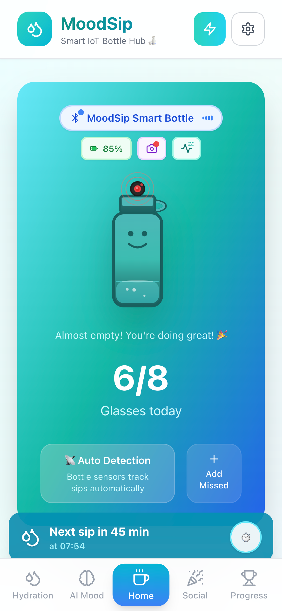
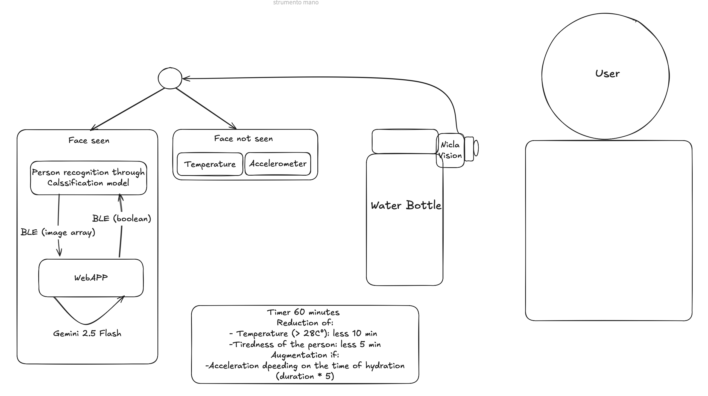
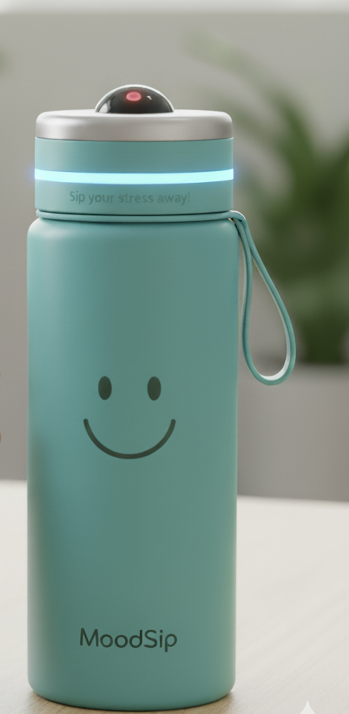
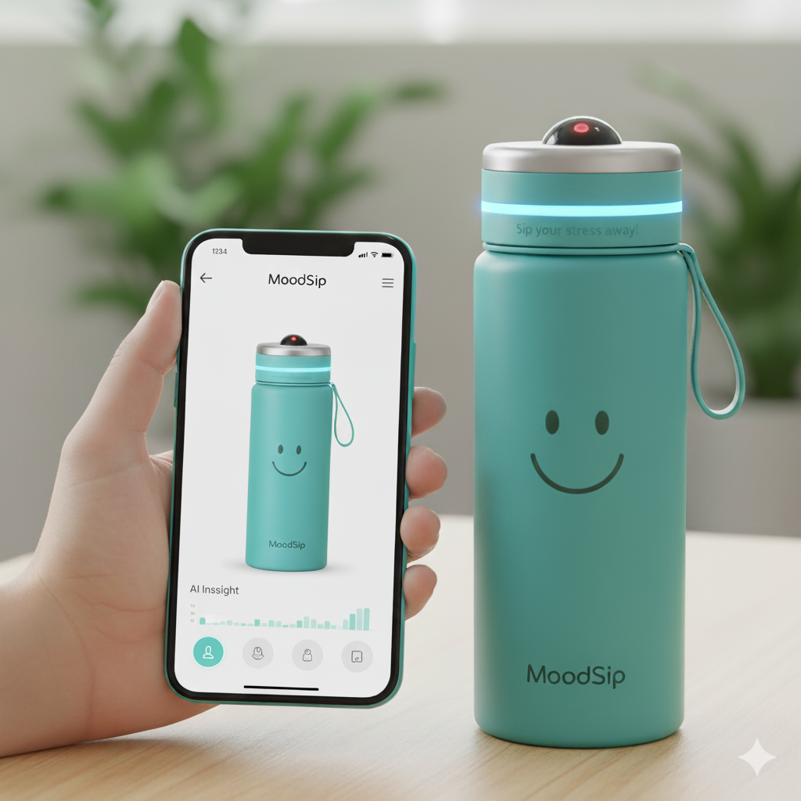
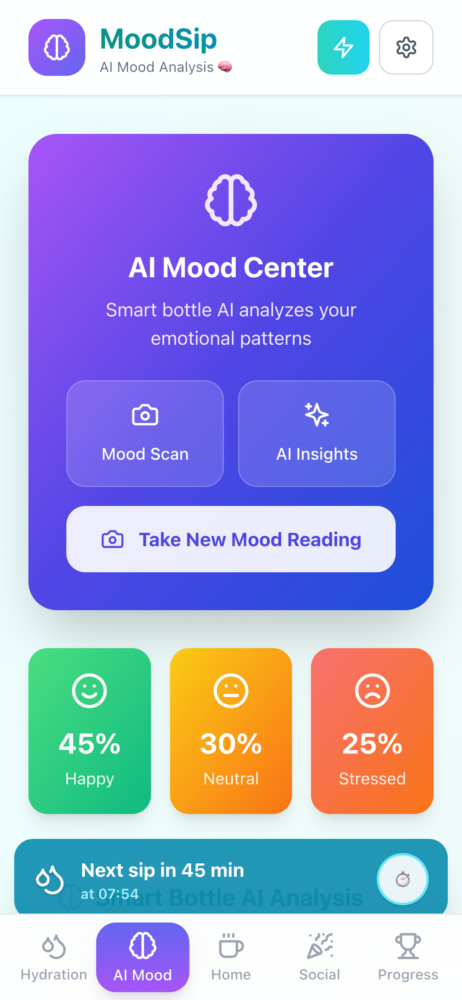
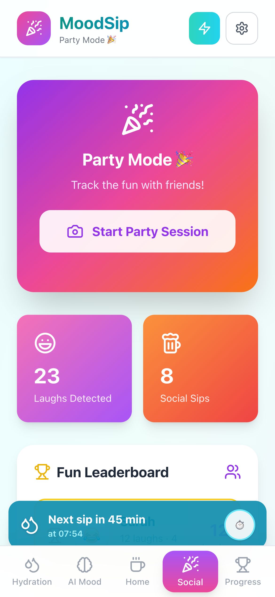
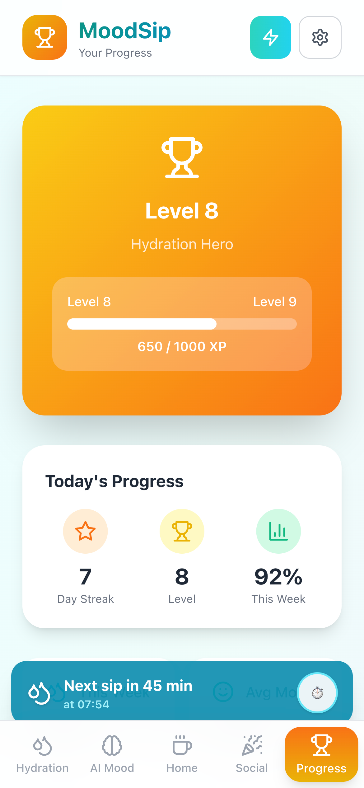
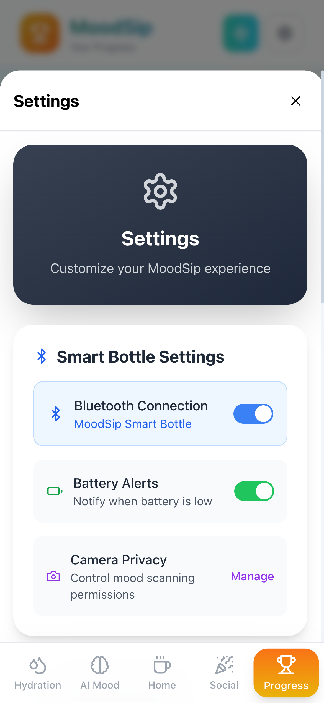

<div align="center">
  
</div>

<br />

<div align="center">
  
</div>

# MoodSip — Sip Your Stress Away 🌟

<div align="center">
  
[](https://youtu.be/YI3l9gEI9GM)
[](#-hackathon-challenge-tinity-hack-2025)
[](#️-technologies)
[](#-features)

</div>

> **Smart hydration meets emotion detection** — The first water bottle that adapts to your stress levels using Edge AI

**MoodSip** revolutionizes hydration by combining **real-time emotion detection** with **intelligent water tracking**. Powered by Arduino Nicla Vision and Edge AI, it provides personalized hydration reminders based on your stress levels, ambient conditions, and drinking patterns.

<div align="center">
  
**👨‍💻 Built by:** [@FrigaZzz](https://github.com/frigazzz) • [@pitadagosti](https://github.com/pitdagosti) • [@davmacario](https://github.com/davmacario) 

</div>

---

## 🚀 Quick Demo

<div align="center">
  
**🎬 [Watch Live Demo](https://youtu.be/YI3l9gEI9GM) | 📱 Try the Web Interface | 🤖 See Edge AI in Action**

</div>

<div align="center">
  
  <br /><i>Real-time wellness dashboard with emotion-aware hydration tracking</i>
</div>

---

## 🎖️ About This Project

MoodSip is designed to make **hydration smarter** and help you manage stress.  
Most smart bottles only remind you to drink; **MoodSip also senses emotions** and adapts its reminders when you seem stressed, hot, or haven't had enough water.

<div align="center">
  
</div>

### 🎨 MoodSip Design Concept

<div align="center">
  <table>
    <tr>
      <td align="center">
        
        <br /><i>Smart bottle prototype with integrated sensors</i>
      </td>
      <td align="center">
        
        <br /><i>Desktop integration and monitoring setup</i>
      </td>
    </tr>
  </table>
</div>

### Why Hydration Matters 💧

- Mild dehydration reduces focus, increases fatigue, irritability, and cortisol spikes.
- Proper hydration = Better physical & mental health.
- Technology can help, but current solutions miss the mind-body connection – **MoodSip fills that gap!**

---

## 🚀 Features

<div align="center">
  <table>
    <tr>
      <td align="center" width="50%">
        
        <br /><b>🧠 Emotion Detection Interface</b>
      </td>
      <td align="center" width="50%">
        
        <br /><b>💧 Smart Hydration Monitoring</b>
      </td>
    </tr>
  </table>
</div>

- **Emotion Detection:** Recognizes signs of stress via camera and ML on-board (no cloud).
- **Adaptive Reminders:** Drinking reminders accelerate when you're stressed or conditions are hot/humid.
- **Smart Intake Estimation:** Uses sensors to track how much you're *actually* drinking.
- **Interactive LED:** Visual feedback — red for stress, blue to prompt drinking.
- **Completely Offline:** All intelligence runs on Arduino Nicla Vision, no internet required.

<div align="center">
  
</div>

---

## ⚡ Quick Start

### 🖥️ Web Application
```bash
# Clone the repository
git clone https://github.com/FrigaZzz/mood-sip.git
cd mood-sip/1-mood-sip/src/mood-sip-web

# Install dependencies and start
npm install
npm run dev
```

### 🤖 Edge AI Engine
```bash
# Navigate to edge engine
cd 1-mood-sip/src/edge_vision_engine

# Set up Python environment
uv sync
source .venv/bin/activate

# Run the AI service
python main.py
```

### 🔧 Arduino Setup
1. Flash the `.ino` sketch to Arduino Nicla Vision
2. Deploy the quantized ONNX model using Zant
3. Connect sensors and test the system

> 📖 **Detailed setup guide:** [Technical Documentation](1-mood-sip/docs/software.md)

---

## 🥤 Fun Mode: The Party Game

<div align="center">
  
  <br /><i>Interactive party game mode - keep a straight face or take a sip!</i>
</div>

MoodSip doubles as a party game!
- Keep a poker face; if the camera detects a smile or emotional change, **red LED** lights up and you "lose" – take a sip!
- Brings together social interaction and wellness awareness.
- Perfect for parties, team building, or just having fun with friends!

---

## 🏆 Project Impact

- Encourages public health: hydration + stress management.
- Supports well-being for elderly, professionals, athletes.
- Promotes *holistic* wellness — understanding the mind-body connection.
- Potential to reduce dehydration-related health issues.

<div align="center">
  
  <br /><i>Engaging gamification elements make wellness tracking fun and rewarding</i>
</div>

---

## 👩‍💻 How It Works

### 1. Facial Expressions (Stress Detection)
- Arduino Nicla Vision camera uses FocoosAI model to detect stress (furrowed brows, tired eyes).
- Stressed? LED turns **red** & reminder timer shortens.

### 2. Ambient Temperature & Humidity
- Sensor triggers more frequent reminders when hot/humid.

### 3. Intake Tracking
- Proximity and gyroscope sensors estimate water intake.
- Less intake? Next reminder comes sooner.

> **All logic runs onboard using Edge AI (fully offline).**

---

## 🛠️ Tech Stack

<div align="center">

| **Hardware** | **AI/ML** | **Web** | **Tools** |
|:---:|:---:|:---:|:---:|
| Arduino Nicla Vision | FocoosAI | React/TypeScript | Zant |
| Camera & Sensors | ONNX Runtime | Vite | UV |
| WiFi/BLE | Edge Inference | Tailwind CSS | Git |

</div>

## ⚙️ Technologies

- **Arduino Nicla Vision:** Camera + sensors + WiFi/BLE
- **Focoos AI:** Computer vision for emotion recognition
- **Zant:** Deployment of quantized ONNX models on MCU
- **ONNX:** Model export format
- **Web App:** For demos and further visualization

---

## 📚 References

- [Dehydration: the enemy of our body](https://medimutua.org/disidratazione-il-nemico-del-nostro-organismo/)
- [Trends in Dehydration in Older People](https://www.mdpi.com/2072-6643/17/2/204)
- [This Simple Everyday Health Tweak Can Help Reduce Anxiety](#)
- [5 Best Smart Water Bottles of 2024](#)
- **Existing products:** HidrateSpark, REBO — track water, but **MoodSip** tracks mood too!

---

<div align="center">
  
  <br /><i>Comprehensive settings panel for personalized wellness tracking</i>
</div>

## 📝 Technical Overview

For full technical documentation [see here](1-mood-sip/docs/software.md).

---

## 🏅 Hackathon Challenge: Tinity Hack 2025

<div align="center">
  
</div>

**MoodSip was developed for the Tinity Hack [Tiny Hacks] Edge AI Hackathon!**

### 🎯 Challenge Requirements
- ✅ **Creative Computer Vision App** using Focoos platform
- ✅ **ONNX Export & Quantization** for edge deployment
- ✅ **Arduino Nicla Vision** as target hardware
- ✅ **Zant Integration** for model flashing

### 🏆 Competition Categories
| Trophy | Category | Description |
|:---:|:---|:---|
| 🏆 | **Impact Trophy** | Most innovative application |
| 💻 | **Clean Code Champion** | Best software engineering |
| 🚀 | **Technical Trophy** | Most impressive technical solution |

### 📦 Our Submission
- 🔧 Arduino `.ino` sketch with sensor integration
- 🤖 Quantized `.onnx` model for emotion detection
- 📱 Complete web application with real-time interface
- 📖 Comprehensive documentation and setup guides
- 🎨 AI-generated prototype designs

> 🙏 **Special thanks** to the Tinity Hack organizers for an inspiring challenge!
  
---

## 💡 Resources & Credits

- **Focoos Platform:** Model training & ONNX export  
- **Zant:** MCU deployment via quantized ONNX  
- **Arduino Nicla Vision:** Edge AI platform  
- [MoodSip Video Presentation](https://youtu.be/YI3l9gEI9GM)  
- Project repo: [github.com/FrigaZzz/mood-sip](https://github.com/FrigaZzz/mood-sip)  

---

## 🤝 Contributing

We welcome contributions! Here's how you can help:

- 🐛 **Report bugs** via [Issues](https://github.com/FrigaZzz/mood-sip/issues)
- 💡 **Suggest features** or improvements
- 🔧 **Submit pull requests** for bug fixes or enhancements
- 📖 **Improve documentation** and guides
- ⭐ **Star the repo** if you find it useful!

### Development Setup
1. Fork the repository
2. Create a feature branch: `git checkout -b feature/amazing-feature`
3. Commit your changes: `git commit -m 'Add amazing feature'`
4. Push to the branch: `git push origin feature/amazing-feature`
5. Open a Pull Request

---

## 📄 License

This project is licensed under the MIT License - see the [LICENSE](LICENSE) file for details.

---

<div align="center">
  
### 🌟 **Sip your stress away** 🌟
**MoodSip: The water bottle that gets you**

[](https://github.com/FrigaZzz/mood-sip/stargazers)
[](https://github.com/FrigaZzz/mood-sip/network/members)

**Made with ❤️ for wellness and edge AI**

</div>
